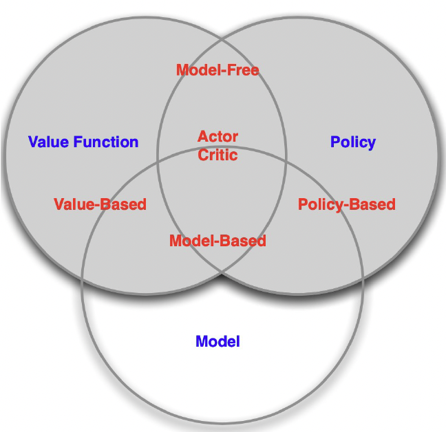

# 강화학습 (Reinforcement Learning) 입문 가이드

> 처음 강화학습을 배우는 사람을 위한 핵심 개념 정리

---

## 🎯 강화학습이란?

**강화학습(Reinforcement Learning, RL)** 은 현재의 **State(상태)** 에서 어떤 **Action(행동)** 을 취하는 것이 최적인지 학습하는 방법입니다.

- 행동을 취할 때마다 외부 **Environment(환경)** 에서 **Reward(보상)** 이 주어집니다
- 이러한 보상을 **최대화** 하는 방향으로 학습이 진행됩니다

```
Agent(에이전트) ⟷ Environment(환경)
    ↓ Action           ↓ State, Reward
  (오른쪽 이동)        (현재 위치 : 5, 보상 : +1)
```

---

## 🏆 강화학습의 목표

### Optimal Policy (π<sup>\*</sup>) 찾기

에이전트가 장기적으로 받을 **누적 보상(Return)** 을 최대화하는 **최적 정책(Optimal Policy)** π<sup>\*</sup> 를 찾는 것이 강화학습의 목표입니다.

**수식:**

$$\pi^{\ast}(s) = \arg\max_a Q^{\ast}(s,a)$$

**의미:**
- $\pi^{\ast}(s)$ : 상태 s에서의 최적 정책 (최적의 행동)
- $\arg\max_a$ : 가장 큰 값을 만드는 행동 a를 선택
- $Q^{\ast}(s,a)$ : 상태 s에서 행동 a의 최적 가치
- $^{\ast}$ : Optimal(최적의) 라는 뜻
- **해석**: 각 상태에서 Q값이 가장 높은 행동을 선택하는 것이 최적 정책!

---

## 📚 강화학습 기본 용어

### 1. State (상태, S)

**정의:**
- 환경에서 에이전트가 현재 위치한 상태
- 에이전트가 관찰할 수 있는 환경의 정보

**쉬운 이해:**
- 게임 캐릭터의 현재 위치
- 체스판의 현재 배치
- 자동차의 현재 속도와 위치

**예시:**
```python
current_state = 0  # 16개 상태 중 0번 상태
```

---

### 2. Action (행동, A)

**정의:**
- 특정 상태에서 에이전트가 수행할 수 있는 선택지

**쉬운 이해:**
- 게임에서 선택할 수 있는 버튼 (점프, 공격, 방어)
- 미로에서 움직일 방향 (상, 하, 좌, 우)

**예시:**
```python
n_actions = 4  # 상, 하, 좌, 우
action = 0  # "상" 선택
```

---

### 3. Reward (보상, R)

**정의:**
- 행동을 수행한 후 환경으로부터 받는 피드백 신호
- 에이전트의 행동이 얼마나 좋았는지를 나타내는 수치

**쉬운 이해:**
- 게임에서 적을 물리치면 +10점
- 벽에 부딪히면 -1점
- 목표에 도달하면 +100점

**특징:**
- **즉각적인 보상**: 행동 직후 바로 받는 보상
- Value Function과는 다름 (Value는 미래의 누적 보상)

**예시:**
```python
reward = 1 if next_state == goal_state else 0
```

---

### 4. Episode (에피소드)

**정의:**
- 시작 상태에서 종료 상태(목표 또는 실패)까지 도달하는 일련의 과정

**쉬운 이해:**
- 게임 한 판 (시작 → 게임 오버 또는 승리)
- 미로 찾기 한 번 (출발 → 목표 도달 또는 포기)

**예시:**
```python
for episode in range(1000):  # 1000번의 에피소드
    state = initial_state
    while not done:
        action = select_action(state)
        next_state, reward, done = env.step(action)
```

---

### 5. Agent (에이전트)

**정의:**
- 환경과 상호작용하며 학습하는 주체
- 상태를 관찰하고 행동을 선택하는 학습자

**쉬운 이해:**
- 게임을 플레이하는 AI
- 미로를 탈출하려는 로봇
- 체스를 두는 컴퓨터

---
### 6. Return ($G_t$)

**정의:**
- 시점 t부터 받게 될 모든 보상의 '감가(discount)'총합이다.

**쉬운 이해:**
- 현재 시점부터 앞으로 받게 될 모든 보상(reward)을 감가율을 적용해 더한 값.

**수식:**

$$
G_t = R_{t+1} + \gamma R_{t+2} + \gamma^2 R_{t+3} + \cdots 
     = \sum_{k=0}^{\infty} \gamma^k R_{t+k+1}
$$

$G_t$ : 시점 $t$에서의 리턴(return)\
$R_{t+1}$ : $t+1$ 시점에서 받는 보상(reward)\
$\gamma$ $(0 \le \gamma \le 1 )$: 감가율(Discount factor), 미래 보상에 대한 신뢰도 (비유 : 미래의 돈은 현재보다 덜 가치 있다는 의미)

**수식 의미:**
- 앞으로 받을 보상(reward)들을 하나로 모아서 현재 가치로 계산한 것

---

## 🔄 강화학습의 수학적 기반: MP → MRP → MDP

강화학습을 이해하기 위한 수학적 프레임워크를 단계별로 알아봅시다.

---

### 1️⃣ Markov Process (MP) = Markov Chain

**형식적 정의:** $\langle \mathcal{S}, \mathcal{P} \rangle$

**정의:**
- 상태(State)들 간의 전이(Transition)만 있는 가장 기본적인 모델
- **보상(Reward)**도 없고, **행동(Action)**도 없음
- 현재 상태만 알면 미래를 예측할 수 있음 (**Markov Property**)

**구성 요소:**
- $\mathcal{S}$ : 상태 집합 (State Space)
- $\mathcal{P}$ : 상태 전이 확률 행렬 (Transition Probability Matrix)

**수식:**

$$\mathcal{P}_{ss'} = P[S_{t+1} = s' \mid S_t = s]$$

**의미:** 
- 상태 s에서 상태 s'로 이동할 확률

**Markov Property (마르코프 성질):**

$$P[S_{t+1} \mid S_t] = P[S_{t+1} \mid S_1, S_2, \ldots, S_t]$$

**의미:**
- 미래는 **오직 현재 상태**에만 의존함
- 과거의 모든 역사는 **현재 상태에 이미 포함**되어 있음
- "**현재가 미래를 결정한다**" (과거는 무시)

**쉬운 비유:**
```
날씨 예측 예시:
- 오늘 맑음 → 내일 비올 확률 30%
- 오늘 비옴 → 내일 맑을 확률 60%

→ 어제가 어땠는지는 중요하지 않음!
→ 오늘의 날씨만 알면 내일을 예측 가능
```


---

### 2️⃣ Markov Reward Process (MRP)

**형식적 정의:** $\langle \mathcal{S}, \mathcal{P},\mathcal{R}, \gamma \rangle$

**정의:**
- Markov Process + **Reward (보상)** 추가
- 아직 **Action(행동)**은 없음
- 상태 전이가 자동으로 일어나며, 보상을 받음

**구성 요소:**
- $\mathcal{S}$ : 상태 집합
- $\mathcal{P}$ : 상태 전이 확률 행렬
- $\mathcal{R}$ : **보상 함수 (Reward Function)** ✨ 추가됨
- $\gamma$ : 할인율 (Discount Factor, 0 ≤ γ ≤ 1)

**수식:**

$$\mathcal{R}_s = \mathbb{E}[R_{t+1} \mid S_t = s]$$

**의미:**
- 상태 s에 있을 때 받을 평균 보상

**Return (수익):**

$$G_t = R_{t+1} + \gamma R_{t+2} + \gamma^2 R_{t+3} + \cdots = \sum_{k=0}^{\infty} \gamma^k R_{t+k+1}$$

**Value Function (가치 함수):**

$$V(s) = \mathbb{E}[G_t \mid S_t = s] = \mathbb{E}[R_{t+1} + \gamma V(S_{t+1}) \mid S_t = s]$$

**의미:**
- 상태 s에서 시작해서 미래에 받을 모든 보상의 기댓값

**쉬운 비유:**
```
게임 예시 (자동 진행):
- 집에 있으면: +1점, 다음 상태로 자동 이동
- 학교에 있으면: +5점, 다음 상태로 자동 이동
- 도서관에 있으면: +3점, 다음 상태로 자동 이동

→ 우리는 선택할 수 없음, 그냥 자동으로 진행됨
→ 하지만 각 상태에서 보상은 받음
```


---

### 3️⃣ Markov Decision Process (MDP)

**형식적 정의:** $\langle \mathcal{S}, \mathcal{A}, \mathcal{P}, \mathcal{R}, \gamma \rangle$

**정의:**
- MRP + **Action (행동)** 추가 ✨
- **Agent가 행동을 선택**할 수 있음
- **강화학습의 표준 프레임워크** 🎯

**구성 요소:**
- $\mathcal{S}$ : 상태 집합 (State Space)
- $\mathcal{A}$ : **행동 집합 (Action Space)** ✨ 추가됨
- $\mathcal{P}$ : 상태 전이 확률 행렬 (이제 행동에 따라 달라짐)
- $\mathcal{R}$ : 보상 함수 (이제 행동에 따라 달라짐)
- $\gamma$ : 할인율 (Discount Factor)

**수식:**

$$\mathcal{P}^a_{ss'} = P[S_{t+1} = s' \mid S_t = s, A_t = a]$$

**의미:**
- 상태 s에서 **행동 a를 선택**했을 때, 상태 s'로 이동할 확률

$$\mathcal{R}^a_s = \mathbb{E}[R_{t+1} \mid S_t = s, A_t = a]$$

**의미:**
- 상태 s에서 **행동 a를 선택**했을 때 받을 평균 보상

**Policy (정책):**

$$\pi(a|s) = P[A_t = a \mid S_t = s]$$

**의미:**
- 상태 s에서 행동 a를 선택할 확률
- Agent의 행동 전략

**쉬운 비유:**
```
게임 예시 (내가 선택):
- 집에서: [공부하기, TV보기, 잠자기] 선택 가능
- 학교에서: [수업듣기, 친구만나기, 도서관가기] 선택 가능

→ 내가 행동을 선택할 수 있음!
→ 선택한 행동에 따라 다음 상태와 보상이 달라짐
```


---

### 📊 MP → MRP → MDP 비교표

| 요소 | MP | MRP | MDP |
|------|-----|------|------|
| **형식적 정의** | $\langle \mathcal{S}, \mathcal{P} \rangle$ | $\langle \mathcal{S}, \mathcal{P}, \mathcal{R}, \gamma \rangle$ | $\langle \mathcal{S}, \mathcal{A}, \mathcal{P}, \mathcal{R}, \gamma \rangle$ |
| **State (상태)** | ✅ | ✅ | ✅ |
| **Transition (전이)** | ✅ | ✅ | ✅ (행동 선택에 따라 달라짐) |
| **Reward (보상)** | ❌ | ✅ | ✅ (행동 선택에 따라 달라짐) |
| **Action (행동)** | ❌ | ❌ | ✅ |
| **Discount Factor (γ)** | ❌ | ✅ | ✅ |
| **Policy (정책)** | ❌ | ❌ | ✅ |
| **Agent의 선택** | ❌ (자동 진행) | ❌ (자동 진행) | ✅ (Agent가 선택) |

---

### 🎯 핵심 정리

**단계별 발전:**

```
MP (Markov Process)
  └─> "상태만 있음, 자동으로 이동"
       ↓ + Reward
MRP (Markov Reward Process)
  └─> "보상 추가, 여전히 자동 이동"
       ↓ + Action
MDP (Markov Decision Process)
  └─> "행동 선택 가능! → 강화학습의 기본"
```

**왜 MDP가 중요한가?**
- 강화학습의 **표준 프레임워크**
- 대부분의 RL 문제는 MDP로 모델링 가능
- MDP를 이해하면 모든 RL 알고리즘 이해 가능


---

## 🧠 RL Agent의 3가지 핵심 요소

강화학습 에이전트는 다음 3가지 요소로 구성됩니다:

---

### 1️⃣ Policy (정책, π)

**정의:**
- Agent의 행동을 결정해주는 함수
- State(현재 상태)에서 Action(행동)을 선택하도록 정해줌

**쉬운 이해:**
- 에이전트가 행동을 결정하는 **전략** 또는 **규칙**
- "이 상황에서는 이렇게 행동해!" 라는 지침

**수식:**

$$\pi(a|s) = P[A_t = a \mid S_t = s]$$


**수식 의미:**
- 상태 s에서 행동 a를 선택할 확률

**종류:**

1. **Deterministic Policy (결정적 정책)**
   
   $$a = \pi(s)$$
   
   - 상태 s가 주어지면 항상 같은 행동 a를 선택
   - 예: "출구가 오른쪽에 있으면 항상 오른쪽으로 이동"

2. **Stochastic Policy (확률적 정책)**
   
   $$\pi(a|s) = P[A_t = a \mid S_t = s]$$
   
   - 상태 s에서 여러 행동 중 확률적으로 선택
   - 예: "70% 확률로 오른쪽, 30% 확률로 왼쪽"

**코드 예시:**
```python
# Epsilon-Greedy Policy
if random.random() < epsilon:
    action = random.choice(actions)  # 탐색
else:
    action = argmax(Q_table[state])  # 활용
```

---

### 2️⃣ Value Function (가치 함수)

**정의:**
- 미래에 받을 보상을 평가하는 함수
- 현재 State(상태) 또는 Action(행동)이 얼마나 좋은지 평가

**쉬운 이해:**
- 현재 policy가 얼마나 잘하고 있는지를 **수치로 평가**해주는 함수
- "이 상태에서 미래까지 얼마나 많은 보상을 받을 수 있을까?"

**⚠️ 중요:**
- **Reward ≠ Value Function**
- Reward는 **즉각적인** 보상 (다음 스텝에서 받는 것)
- Value는 **장기적인** 누적 보상의 기댓값

---

#### 2-1. State Value Function (V<sup>π</sup>(s))

상태 s가 얼마나 좋은지 평가

**수식:**

$$V^{\pi}(s) = \mathbb{E}_{\pi}[ G_t \mid S_t = s ]$$

**수식 의미:**
- $G_t$ : Return (누적 보상) = $\sum \gamma^t \times r_t$
- $S_t = s$ : 시간 t에서 상태가 s일 때
- "상태 s에서의 가치는 그 상태에서 얻을 수 있는 누적 보상의 기댓값"

**풀어 쓰면:**

$$V^{\pi}(s) = \mathbb{E}_{\pi}\left[ \sum_{t=0}^{\infty} \gamma^t r_t \mid s_0 = s \right]$$

$$V^{\pi}(s) = \mathbb{E}_{\pi}\left[ r_0 + \gamma r_1 + \gamma^2 r_2 + \gamma^3 r_3 + \cdots \mid s_0 = s \right]$$

**의미:**
- 상태 s에서 시작해서 정책 π를 따를 때
- 앞으로 받을 모든 보상의 할인된 합의 기댓값
- **쉽게 말하면**: "이 상태에 있으면 미래에 얼마나 좋을까?"

**Bellman Equation for State Value Function:**

$$V^{\pi}(s) = \mathbb{E}_{\pi}[ R_{t+1} + \gamma V^{\pi}(S_{t+1}) \mid S_t = s ]$$

**더 자세히 풀어 쓰면:**

$$V^{\pi}(s) = \sum_{a} \pi(a|s) \sum_{s'} P(s'|s,a) \left[ R(s,a,s') + \gamma V^{\pi}(s') \right]$$

**Bellman Equation의 의미:**
- **핵심 아이디어**: 현재 상태의 가치 = 즉각적 보상 + 다음 상태의 할인된 가치
- $R_{t+1}$ : 다음 스텝에서 받을 즉각적 보상
- $\gamma V^{\pi}(S_{t+1})$ : 다음 상태의 가치를 할인율로 조정한 값
- 복잡한 장기 계획을 **재귀적으로 단순화**하는 방법

**직관적 이해:**
```
V(현재 위치) = 한 발 움직여서 받는 보상 + 0.9 × V(다음 위치)

예: 미로 탈출 게임
- 현재 위치 가치 = 이동 보상(+1) + 0.9 × (도착지 가치)
- 만약 도착지 가치가 10이면
  → V(현재) = 1 + 0.9 × 10 = 10
```

---

#### 2-2. Action-Value Function (Q<sup>π</sup>(s,a)) = Q-Function

상태 s에서 행동 a를 했을 때 얼마나 좋은지 평가

**수식:**

$$q^{\pi}(s,a) = \mathbb{E}_{\pi}[ G_t \mid S_t = s, A_t = a ]$$

**수식 의미:**
- $G_t$ : Return (누적 보상) = $\sum \gamma^t \times r_t$
- $S_t = s$ : 시간 t에서 상태가 s일 때
- $A_t = a$ : 시간 t에서 행동이 a일 때
- "상태 s에서 행동 a를 했을 때의 가치는 그때부터 얻을 수 있는 누적 보상의 기댓값"

**풀어 쓰면:**

$$Q^{\pi}(s,a) = \mathbb{E}_{\pi}\left[ \sum_{t=0}^{\infty} \gamma^t r_t \mid s_0 = s, a_0 = a \right]$$

$$Q^{\pi}(s,a) = \mathbb{E}_{\pi}\left[ r_0 + \gamma r_1 + \gamma^2 r_2 + \gamma^3 r_3 + \cdots \mid s_0 = s, a_0 = a \right]$$

**의미:**
- 상태 s에서 행동 a를 선택하고
- 이후 정책 π를 따를 때 받을 모든 보상의 할인된 합의 기댓값
- **쉽게 말하면**: "이 상태에서 이 행동을 하면 미래에 얼마나 좋을까?"

**Bellman Equation for Action-Value Function:**

$$Q^{\pi}(s,a) = \mathbb{E}_{\pi}[ R_{t+1} + \gamma Q^{\pi}(S_{t+1}, A_{t+1}) \mid S_t = s, A_t = a ]$$

**더 자세히 풀어 쓰면:**

$$Q^{\pi}(s,a) = \sum_{s'} P(s'|s,a) \left[ R(s,a,s') + \gamma \sum_{a'} \pi(a'|s') Q^{\pi}(s',a') \right]$$

**Bellman Equation의 의미:**
- **핵심 아이디어**: (상태, 행동)의 가치 = 즉각적 보상 + 다음 (상태, 행동)의 할인된 가치
- $R_{t+1}$ : 행동 a를 취한 후 받는 즉각적 보상
- $\gamma Q^{\pi}(S_{t+1}, A_{t+1})$ : 다음 상태에서 정책 π에 따라 선택한 행동의 가치
- State Value Function과 달리, **행동까지 고려**한 가치

**직관적 이해:**
```
Q(현재 위치, 오른쪽 이동) = 오른쪽 이동 보상 
                          + 0.9 × Q(다음 위치, 다음 행동)

예: 
- 현재 위치에서 "오른쪽" 선택 → 보상 +2
- 다음 위치에서 정책에 따라 "위쪽" 선택할 예정
- Q(다음 위치, 위쪽) = 8
  → Q(현재, 오른쪽) = 2 + 0.9 × 8 = 9.2
```


**Q-Learning 업데이트 수식:**

$$Q(s,a) \leftarrow Q(s,a) + \alpha \left[ r + \gamma \max_{a'} Q(s',a') - Q(s,a) \right]$$

**각 항의 의미:**
- $Q(s,a)$ : 현재 추정치 (지금까지의 추정)
- $\alpha$ : 학습률 (Learning Rate, 얼마나 빨리 업데이트할지)
- $r$ : 즉각적인 보상 (Immediate Reward)
- $\gamma \max_{a'} Q(s',a')$ : 다음 상태에서 얻을 수 있는 최대 가치
- $\left[ \cdots \right]$ : TD Error (시간차 오차) = 실제 - 예측

**Q-Learning과 Bellman Optimality Equation의 관계:**

Q-Learning은 **Bellman Optimality Equation을 반복적으로 적용**하여 최적 Q값을 학습합니다:

```
Bellman Optimality Equation:
Q*(s,a) = E[ r + γ max Q*(s',a') ]
           ↓
Q-Learning은 이를 샘플 업데이트로 근사:
Q(s,a) ← Q(s,a) + α [ r + γ max Q(s',a') - Q(s,a) ]
                        ↑
                  Bellman Target
```

**핵심 차이:**
- **Bellman Equation**: 이론적으로 정확한 Q값 정의 (모든 가능성 고려)
- **Q-Learning**: 실제 경험(샘플)을 통해 Q값을 점진적으로 업데이트

---

### 3️⃣ Model (모델)

**정의:**
- Agent's representation of the environment
- 환경이 어떻게 동작하는지에 대한 에이전트의 내부 표현
- 환경의 규칙을 알고 있으면 **다음 상태(next state)**와 **보상(reward)**을 예측 가능

**쉬운 이해:**
- 에이전트가 환경의 규칙을 머릿속에 표현한 **내적 시뮬레이터**
- "이 행동을 하면 다음에 어떤 상태가 될까?" 를 예측하는 능력

---

#### Model의 두 가지 구성 요소

**1. Transition Model (전이 모델):**

$$P^a_{ss'} = \Pr[ S_{t+1} = s' \mid S_t = s, A_t = a ]$$

**의미:** 상태 s에서 행동 a를 했을 때 상태 s'로 이동할 확률

**예시:**
- 미로에서 "오른쪽"을 선택하면 90% 확률로 실제로 오른쪽으로 이동
- 10% 확률로 미끄러져서 다른 방향으로 이동

**2. Reward Model (보상 모델):**

$$R^a_s = \mathbb{E}[ R_{t+1} \mid S_t = s, A_t = a ]$$

**의미:** 상태 s에서 행동 a를 했을 때 받을 평균 보상

**예시:**
- 상태 5에서 "앞으로" 행동하면 평균 +2점의 보상을 받음

---

## 🔍 RL Agent의 분류 체계 (Taxonomy)

Agent의 3가지 요소(Policy, Value Function, Model)를 어떻게 조합하느냐에 따라 다양한 강화학습 알고리즘이 만들어집니다.



### 분류 설명

#### 1️⃣ **Value-Based (가치 기반)**
- **Value Function만 사용**, Policy는 암묵적 (Value에서 유도)
- Q값이 가장 높은 행동을 선택 (Greedy Policy)
- **대표 알고리즘:**
  - Q-Learning
  - DQN (Deep Q-Network)
  - SARSA

#### 2️⃣ **Policy-Based (정책 기반)**
- **Policy만 직접 학습**, Value Function 없음
- Policy를 직접 파라미터화하여 최적화
- **대표 알고리즘:**
  - REINFORCE
  - Policy Gradient

#### 3️⃣ **Actor-Critic (배우-비평가)**
- **Policy + Value Function 모두 사용**
- Actor(Policy)가 행동을 선택하고, Critic(Value Function)이 평가
- **대표 알고리즘:**
  - A3C (Asynchronous Advantage Actor-Critic)
  - PPO (Proximal Policy Optimization)
  - SAC (Soft Actor-Critic)

#### 4️⃣ **Model-Based (모델 기반)**
- **환경 Model을 학습**하여 미래를 예측
- Model을 사용해 계획(Planning) 수립
- **대표 알고리즘:**
  - Dyna-Q
  - MBPO (Model-Based Policy Optimization)
  - World Models

#### 5️⃣ **Model-Free (모델 없음)**
- **환경 Model 없이** 직접 경험으로 학습
- Value-Based, Policy-Based, Actor-Critic 대부분이 여기 해당
- 계산이 간단하지만, 샘플 효율성이 낮을 수 있음

---

### 🎯 어떤 방법을 선택해야 할까?

| 기준 | Value-Based | Policy-Based | Actor-Critic | Model-Based |
|------|-------------|--------------|--------------|-------------|
| **Action Space** | 이산적 행동 | 연속/이산 모두 | 연속/이산 모두 | 모두 가능 |
| **수렴 안정성** | 상대적으로 안정 | 불안정할 수 있음 | 중간 | 복잡함 |
| **샘플 효율성** | 중간 | 낮음 | 중간 | 높음 |
| **구현 난이도** | 쉬움 | 중간 | 어려움 | 매우 어려움 |
| **대표 사용처** | 게임 AI | 로봇 제어 | 범용 | 시뮬레이션 가능 환경 |


---

## 💡 학습 팁

### 초보자를 위한 학습 순서

1. **개념 이해**
   - State, Action, Reward, Policy 개념 확실히 이해
   - MDP (Markov Decision Process) 개념 학습

2. **간단한 환경에서 실습**
   - Grid World, FrozenLake 같은 간단한 환경
   - Q-Learning으로 시작 (Q-Table 시각화 가능)

3. **심화 학습**
   - DQN (Deep Q-Network)
   - Policy Gradient 방법
   - Actor-Critic 방법

4. **복잡한 환경으로 확장**
   - Atari Games (DQN)
   - Continuous Control (PPO, SAC)
   - Multi-Agent RL

---

## 🔑 핵심 요약

### 강화학습 = 시행착오를 통한 학습

```
┌─────────────────────────────────────────────┐
│  목표: 최적 정책 π* 찾기                        │
│                                             │
│  방법:                                       │
│  1. 행동 → 보상 관찰                           │
│  2. 좋은 행동 → 더 자주 선택                     │
│  3. 나쁜 행동 → 덜 선택                         │
│  4. 반복하며 최적 정책 학습                       │
└─────────────────────────────────────────────┘
```

### Agent의 3대 요소

1. **Policy (π)**: 어떻게 행동할까? (전략)
2. **Value Function (V, Q)**: 이 상태/행동은 얼마나 좋을까? (평가)
3. **Model (P, R)**: 환경이 어떻게 반응할까? (예측)

---


## 추가 예정.
0. Q-learning 내용 순서 알맞게 다시 작성해서 반영하기 (완료)
1. MDP (완료)
2. Q-learning (완료 25.10.17)
3. DQN (완료 25.10.23)
4. PPO


---

**마지막 업데이트:** 2025-10-12

**작성자:** Taein Yong
